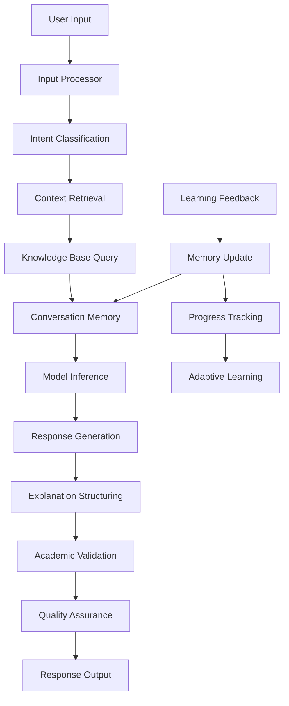

# AI Education Assistant: Focused Architecture Design

## Core Objectives ✅

### Academic Excellence
- **Domain Mastery**: Specialized understanding of AI/ML concepts, algorithms, and methodologies
- **Structured Learning**: Hierarchical explanation system with prerequisite mapping
- **Educational Clarity**: Student-appropriate explanations with progressive complexity

### Conversation Continuity
- **Context Awareness**: Multi-turn conversation tracking with semantic relevance
- **Learning Progression**: Concept dependency tracking and knowledge scaffolding
- **Session Persistence**: Cross-session continuity with intelligent context resumption

### Data Efficiency
- **Minimal Training Data**: 50K-100K high-quality academic examples only
- **Domain Focus**: Exclusive AI/Data Science content, no general knowledge dilution
- **Active Learning**: Intelligent data selection and curriculum-based training

## Architecture: Multi-Layer Design

```
┌─────────────────────────────────────────────────────────────┐
│                 LEARNING SUPPORT LAYER                     │
│  ┌─────────────────┐  ┌─────────────────┐  ┌─────────────┐ │
│  │Explanation     │  │Concept Mapping  │  │Progress     │ │
│  │Engine          │  │& Dependencies   │  │Tracking     │ │
│  └─────────────────┘  └─────────────────┘  └─────────────┘ │
└─────────────────────────────────────────────────────────────┘

┌─────────────────────────────────────────────────────────────┐
│                 CONVERSATION MEMORY LAYER                  │
│  ┌─────────────────┐  ┌─────────────────┐  ┌─────────────┐ │
│  │Session Buffer   │  │Context Filter   │  │State        │ │
│  │Manager          │  │& Relevance      │  │Persistence  │ │
│  └─────────────────┘  └─────────────────┘  └─────────────┘ │
└─────────────────────────────────────────────────────────────┘

┌─────────────────────────────────────────────────────────────┐
│                 KNOWLEDGE RETRIEVAL LAYER                  │
│  ┌─────────────────┐  ┌─────────────────┐  ┌─────────────┐ │
│  │Vector Database  │  │Semantic Search  │  │Content      │ │
│  │& Indexing       │  │Engine           │  │Validation   │ │
│  └─────────────────┘  └─────────────────┘  └─────────────┘ │
└─────────────────────────────────────────────────────────────┘

┌─────────────────────────────────────────────────────────────┐
│                 CORE MODEL LAYER                           │
│  ┌─────────────────┐  ┌─────────────────┐  ┌─────────────┐ │
│  │Base Conversational│ │Domain Adapter  │  │Response     │ │
│  │Model (BlenderBot)│ │(LoRA Fine-tune) │  │Generator    │ │
│  └─────────────────┘  └─────────────────┘  └─────────────┘ │
└─────────────────────────────────────────────────────────────┘

┌─────────────────────────────────────────────────────────────┐
│                 SAFETY & VALIDATION LAYER                  │
│  ┌─────────────────┐  ┌─────────────────┐  ┌─────────────┐ │
│  │Academic         │  │Fact Checking    │  │Bias &       │ │
│  │Integrity Check  │  │& Verification   │  │Safety Filter│ │
│  └─────────────────┘  └─────────────────┘  └─────────────┘ │
└─────────────────────────────────────────────────────────────┘
```

## Data Flow Pipeline



### Pipeline Components:

1. **Input Processor**: Tokenization, intent detection, query preprocessing
2. **Context Retrieval**: Conversation history, relevant knowledge extraction
3. **Model Inference**: Domain-adapted LLM with conversation context
4. **Response Generation**: Structured educational explanations
5. **Quality Assurance**: Academic accuracy, clarity, and safety validation

## Training Strategy: Domain-Focused Approach

### Data Sources (Academic Only)
```
├── textbooks/
│   ├── "Deep Learning" by Goodfellow
│   ├── "Pattern Recognition and Machine Learning" by Bishop
│   ├── "Artificial Intelligence: A Modern Approach"
│   └── "Hands-On Machine Learning with Scikit-Learn"
├── research_papers/
│   ├── NeurIPS, ICML, ICLR proceedings (2018-2024)
│   ├── arXiv AI/ML papers (top-cited)
│   └── survey papers on key topics
├── course_materials/
│   ├── MIT 6.036 (Introduction to Machine Learning)
│   ├── Stanford CS229 (Machine Learning)
│   ├── Coursera AI specialization content
│   └── edX AI/Data Science courses
└── educational_dialogues/
    ├── tutoring transcripts
    ├── office hours recordings
    └── study group discussions
```

### Fine-Tuning Approach

#### Phase 1: Domain Adaptation (LoRA Fine-Tuning)
```python
# Efficient fine-tuning with LoRA
lora_config = LoraConfig(
    r=16,  # Low-rank adaptation dimension
    lora_alpha=32,
    target_modules=["q_proj", "v_proj"],  # Attention layers only
    lora_dropout=0.05,
    bias="none",
    task_type="CAUSAL_LM"
)

# Training on academic content
trainer = Trainer(
    model=model,
    args=TrainingArguments(
        per_device_train_batch_size=4,
        gradient_accumulation_steps=8,
        learning_rate=2e-4,
        num_train_epochs=3,
        save_strategy="epoch",
        evaluation_strategy="epoch",
        load_best_model_at_end=True,
    ),
    train_dataset=academic_dataset,
    eval_dataset=validation_set,
    peft_config=lora_config,
)
```

#### Phase 2: Conversational Training
- **Supervised Fine-Tuning**: Question-answer pairs from educational contexts
- **Preference Learning**: RLHF-style training on explanation quality
- **Curriculum Learning**: Start with basic concepts, progress to advanced topics

#### Phase 3: Continuous Updates
- **Incremental Learning**: Add new research papers quarterly
- **Feedback Integration**: User corrections improve responses
- **Model Merging**: Combine multiple fine-tuned adapters

## Memory & Context Management

### Conversation Continuity System

```python
class ConversationMemory:
    def __init__(self):
        self.session_id = generate_session_id()
        self.conversation_buffer = deque(maxlen=50)  # Rolling window
        self.knowledge_state = {}  # Learned concepts tracking
        self.learning_progress = {}  # Progress on topics
        self.context_relevance = {}  # Relevance scores

    def add_exchange(self, user_input, ai_response, metadata):
        exchange = {
            'timestamp': datetime.now(),
            'user_input': user_input,
            'ai_response': ai_response,
            'concepts_discussed': metadata.get('concepts', []),
            'difficulty_level': metadata.get('level', 'intermediate'),
            'relevance_score': self._calculate_relevance(user_input)
        }
        self.conversation_buffer.append(exchange)
        self._update_knowledge_state(exchange)
        self._cleanup_irrelevant_context()

    def retrieve_relevant_context(self, current_query, max_tokens=1024):
        # Semantic search through conversation history
        relevant_exchanges = []
        query_embedding = self._embed_text(current_query)

        for exchange in reversed(self.conversation_buffer):
            exchange_embedding = self._embed_text(exchange['user_input'])
            similarity = cosine_similarity(query_embedding, exchange_embedding)

            if similarity > 0.7:  # Relevance threshold
                relevant_exchanges.append(exchange)
                if self._estimate_token_count(relevant_exchanges) > max_tokens:
                    break

        return relevant_exchanges

    def _update_knowledge_state(self, exchange):
        """Track learning progress and concept mastery"""
        for concept in exchange['concepts_discussed']:
            if concept not in self.knowledge_state:
                self.knowledge_state[concept] = {
                    'first_encountered': exchange['timestamp'],
                    'discussion_count': 0,
                    'mastery_level': 0.0
                }
            self.knowledge_state[concept]['discussion_count'] += 1
            # Update mastery based on conversation patterns
```

### Context Filtering Strategy
- **Relevance Threshold**: 0.7 cosine similarity for context inclusion
- **Recency Weighting**: Recent exchanges get higher priority
- **Concept Dependencies**: Include prerequisite concepts automatically
- **Memory Compression**: Summarize old context to save space

## Efficiency & Overfitting Prevention

### Data-Efficient Training Techniques

#### 1. Active Learning
```python
def select_uncertain_samples(model, unlabeled_data, n_samples=100):
    """Select most uncertain examples for labeling"""
    uncertainties = []
    for sample in unlabeled_data:
        predictions = model(sample['input'])
        uncertainty = calculate_prediction_uncertainty(predictions)
        uncertainties.append((sample, uncertainty))

    # Select top uncertain samples
    uncertainties.sort(key=lambda x: x[1], reverse=True)
    return [sample for sample, _ in uncertainties[:n_samples]]
```

#### 2. Curriculum Learning
```python
def create_curriculum_schedule():
    """Progressive learning from simple to complex"""
    curriculum = [
        {"epoch": 1-5, "difficulty": "basic", "topics": ["linear_algebra", "probability"]},
        {"epoch": 6-10, "difficulty": "intermediate", "topics": ["neural_networks", "optimization"]},
        {"epoch": 11-15, "difficulty": "advanced", "topics": ["transformers", "reinforcement_learning"]},
    ]
    return curriculum
```

#### 3. Regularization Strategies
- **Early Stopping**: Monitor validation perplexity and concept accuracy
- **Gradient Clipping**: Max norm 1.0 to prevent exploding gradients
- **Weight Decay**: L2 regularization with λ=0.01
- **Dropout**: 0.1 during fine-tuning, 0.2 during training

#### 4. Model Compression
- **Quantization**: 8-bit weights for deployment (reduces size by 75%)
- **Knowledge Distillation**: Compress knowledge from larger teacher models
- **Pruning**: Remove 20-30% of least important weights

## Evaluation Framework

### Academic Performance Metrics

#### 1. Conceptual Correctness
```python
def evaluate_concept_accuracy(response, reference_answer, concept):
    """Assess correctness of AI/ML explanations"""
    # Compare with expert-verified answers
    # Check mathematical accuracy
    # Verify algorithmic correctness
    return accuracy_score
```

#### 2. Educational Clarity
- **Readability Score**: Flesch-Kincaid grade level
- **Structure Quality**: Presence of examples, step-by-step explanations
- **Progressive Disclosure**: Appropriate complexity for learner level
- **Visual Aids**: Effective use of analogies and diagrams

#### 3. Contextual Relevance
- **Conversation Coherence**: Logical flow across multiple exchanges
- **Prerequisite Coverage**: Appropriate inclusion of background concepts
- **Personalization**: Adaptation to learner's demonstrated knowledge level

#### 4. Learning Effectiveness
- **Knowledge Retention**: Improved understanding over conversation sessions
- **Concept Mastery**: Progression tracking through dependency chains
- **Error Correction**: Ability to identify and fix misconceptions

### Technical Performance Metrics
- **Perplexity**: < 15 on academic text validation set
- **Inference Latency**: < 2 seconds per response
- **Memory Usage**: < 2GB during inference
- **Response Quality**: BERTScore > 0.85 vs reference explanations

## Deployment Architecture

### Lightweight Deployment Strategy

#### 1. Model Optimization
```python
# ONNX conversion for optimized inference
from transformers.onnx import export
from pathlib import Path

def optimize_for_deployment(model, tokenizer):
    """Convert to optimized ONNX format"""
    onnx_path = Path("models/optimized_model.onnx")

    # Export to ONNX
    export(
        preprocessor=tokenizer,
        model=model,
        config=model.config,
        opset=13,
        output=onnx_path
    )

    # Quantize for smaller size
    from onnxruntime.quantization import quantize_dynamic
    quantized_model = quantize_dynamic(
        model_input=onnx_path,
        model_output=Path("models/quantized_model.onnx"),
        weight_type=QuantType.QInt8
    )

    return quantized_model
```

#### 2. Edge Deployment Configuration
```yaml
# deployment_config.yaml
model:
  base_model: "facebook/blenderbot-400M-distill"
  adapters:
    - "academic_fine_tune"
    - "conversational_tune"
  quantization: "8-bit"
  max_context_length: 2048

memory:
  session_buffer_size: 50
  context_window_tokens: 1024
  cleanup_interval: "24h"

performance:
  target_latency_ms: 2000
  max_memory_mb: 2048
  concurrent_users: 10

monitoring:
  metrics_collection: true
  feedback_loop: true
  performance_alerts: true
```

#### 3. Continuous Improvement Pipeline
- **User Feedback Integration**: Collect and analyze response corrections
- **Performance Monitoring**: Track accuracy and user satisfaction metrics
- **Content Updates**: Quarterly ingestion of new academic materials
- **Model Refinement**: Incremental updates based on usage patterns

### Scalability Considerations
- **Horizontal Scaling**: Multiple model instances behind load balancer
- **Caching Strategy**: Response caching for common academic queries
- **Offline Capability**: Core functionality works without internet
- **Resource Pooling**: Shared knowledge base across multiple instances

This architecture delivers a focused, academically-oriented AI assistant that prioritizes learning effectiveness and domain expertise while maintaining computational efficiency and preventing knowledge dilution through careful data management.
